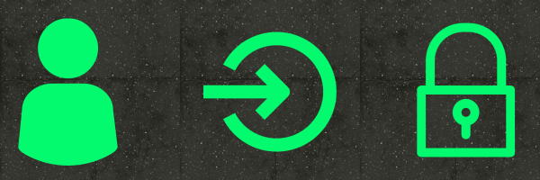
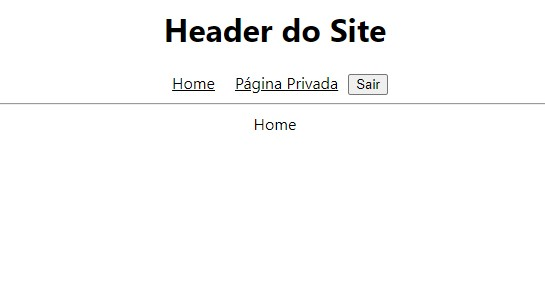
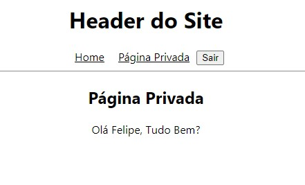
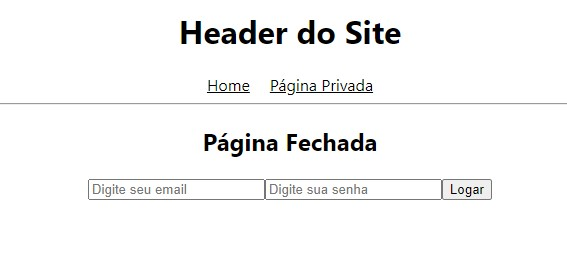

# React - Login 🔐



Um App de login feito com ReactJS utilizando Axios e React-Router-Dom - Feito com 💚

> Status do Projeto: Em Testes... ⚠️

## Índice
- <a href="#funcionalidades">Funcionalidades do Projeto</a>
- <a href="#layout">Layout</a>
- <a href="#demonstracao">Demonstração</a>
- <a href="#rodar">Como rodar este projeto?</a>
- <a href="#tecnologias">Tecnologias Utilizadas</a>
- <a href="#autores">Pessoas Autores</a>
- <a href="#passos">Próximos Passos</a>

## Funcionalidades do Projeto - 🔨 <div id="#funcionalidades"></div>
- [x] Entrar em uma tela privada utilizando login
- [x] Persistência de login com Token
- [x] API própria

## Layout - 🎨 <div id="#layout"></div>




## Demonstração - 💻 <a id="#demonstracao"></a>


## Como Rodar Este Projeto? - ⚙️ <div id="#rodar"></div>

``` bash
# Clone este repositório
$ git clone https://github.com/FelipeKreulich/login-react

# Acesse a pasta do projeto em seu terminal
$ cd login-react

# Instale as dependências da Aplicação
$ npm install

# Execute a aplicação
$ npm start
```
## Tecnologias Utilizadas - 🔨 <div id="#tecnologias"></div>

1. [Typescript](https://www.typescriptlang.org/) 
2. [Axios](https://www.npmjs.com/package/axios)
3. [React-Router-Dom](https://www.npmjs.com/package/react-router-dom) 

## Pessoas Autores - 🚻 <div id="#autores"></div>


Felipe Kreulich

[Linkedin](www.linkedin.com/in/felipe-kreulich/)

[Portfolio](https://portfolio-felipe.vercel.app)

## Próximos Passos - 🚶🏻 <div id="#passos"></div>
- [ ] Criar Novo Layout